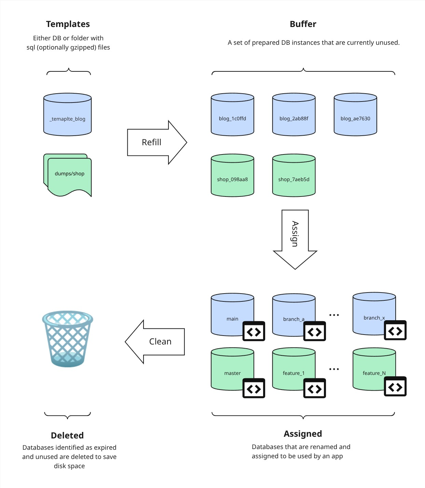

# dbshuffle

dbshuffle pre-creates copies of MySQL database templates so they can be assigned to a name instantly — without waiting for a full copy at request time. Useful for test environments where each test run needs a fresh, isolated database.

## Table of contents

- [How it works](#how-it-works)
- [Quick start](#quick-start)
- [CLI reference](#cli-reference)
- [HTTP API](#http-api)
- [Helm chart](#helm-chart)
- [Observability](#observability)
- [Development & contribution](#development--contribution)

## How it works

1. You define one or more **templates** — existing MySQL databases or folders with dumps that serve as the source of truth.
2. dbshuffle maintains a **buffer** of ready copies for each template (named `<template>_<uuid>`).
3. When you **assign** a template to a name, one buffered copy is instantly renamed to that name.
4. Assigned databases **expire** after a configurable number of hours. Running **clean** drops them.
5. Running **refill** (or letting the server do it in the background) tops the buffer back up.

The tool works with a single DB server, creating multiple logical databases (schemas).

Dev dumps should not contain db names (`use <db>` statements), or elements prefixed with schema name (i.e. `create table <schema>.<table>`).

All state is tracked in the `_dbshuffle` management schema on the same server.



## Quick start

### Install

**Download a pre-built binary** from the [Releases](https://github.com/obukhov/dbshuffle/releases) page — pick the archive for your OS and architecture, extract, and place the binary on your `$PATH`:

```bash
tar -xzf dbshuffle_linux_amd64.tar.gz
mv dbshuffle /usr/local/bin/
```

**Run with Docker:**

```bash
docker run --rm \
  -e DB_HOST=your-mysql-host \
  -e DB_PASSWORD=secret \
  -v $(pwd)/config.yaml:/config.yaml \
  ghcr.io/obukhov/dbshuffle:latest status
```

**Build from source** (requires Go 1.21+):

```bash
git clone https://github.com/obukhov/dbshuffle.git
cd dbshuffle
go build -o dbshuffle ./cmd
```

**Install in k8s**

To install the tool in k8s cluster use provided [Helm Chart](docs/helm.md)

### Configuration

```yaml
# config.yaml
dbtemplates:
  blog:
    from_db: '_template_blog'    # copy from an existing MySQL database
    buffer: 3                    # number of copies to keep ready
    expire: 24                   # hours before an assigned database is considered expired
  shop:
    from_path: 'dumps/shop'      # copy from a directory of SQL files (mutually exclusive with from_db)
    buffer: 2
    expire: 48
```

Each template requires exactly one source — `from_db` or `from_path`, not both.

**`from_path`** points to a directory. dbshuffle reads all `.sql` and `.sql.gz` files in that directory (in sorted order) and executes them in a single transaction to seed the new database. Plain `.sql` and gzip-compressed `.sql.gz` files can be mixed freely.

### Run

**Use in CLI mode**

```bash
# Fill the buffer for all templates - you should run that to refill the buffers
dbshuffle refill

# Assign a database to a name <template name> <new database name>
dbshuffle assign blog myfeature_test

# Run to delete expired DB instances and reclaim disk space
dbshuffle clean

# Check status
dbshuffle status
```

**To run in server mode and have all operations available via HTTP API run:**

```bash
# Start the HTTP server
dbshuffle server
```

Connection parameters can be provided as options or env variables, see [CLI reference](docs/cli.md).

All operations can be triggered via HTTP API (when `server` is running). See [HTTP API](docs/api.md).

## CLI reference

Commands: `status`, `assign`, `reset`, `refill`, `clean`, `server`. Global flags cover MySQL connection and config path; all flags are also available as env vars.

See **[docs/cli.md](docs/cli.md)** for the full flag reference and command descriptions.

## HTTP API

Endpoints: `GET /status`, `POST /assign`, `POST /reset`, `POST /clean`, `POST /refill`. All return `Content-Type: application/json`.

See **[docs/api.md](docs/api.md)** for request/response shapes and status codes.

## Observability

Traces, metrics, and logs can be connected via OpenTelemetry. Disabled by default; enabled through env vars.

See **[docs/observability.md](docs/observability.md)** for env var reference, quick-start examples, and details on what is traced and measured.

## Helm chart

Install from OCI registry; configure MySQL connection, template definitions, and OTel via `values.yaml`.

See **[docs/helm.md](docs/helm.md)** for the full values reference, connection setup, and OTel configuration example.

## Development & contribution

See **[docs/development.md](docs/development.md)** for prerequisites, project structure, local MySQL setup, test template descriptions, and the full Makefile reference.
